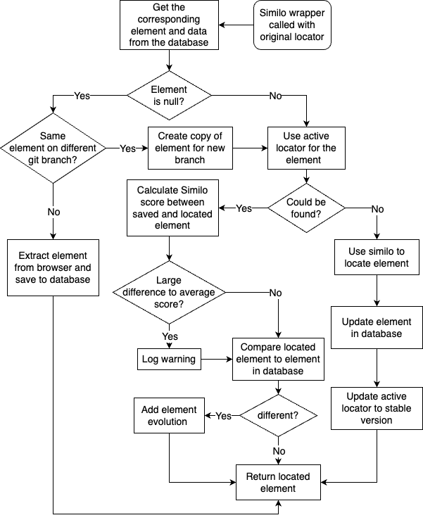
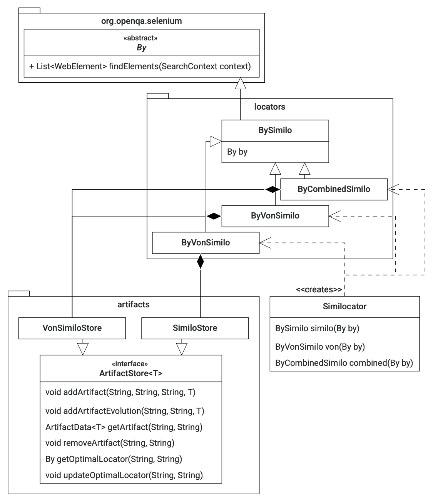

# Implementation details

## Workflow

The workflow of a program using Similo can be found in the following. Two aspects of the flowchart require further explanation. 

First is the error logging. An error is logged if the Similo score between the found element and the element stored in the database differs too much. For example, if there are multiple bar menu items located by \xpath{} and the items switch places, the \xpath{} for element A may return a locator for element B. This can lead to the test case going in the wrong direction and make it challenging to identify the cause of the failing test case. To prevent this, we compare the score of the found element and the element in the database with historical scores. If the score difference exceeds a threshold (which can be configured but is set to 0.2 by default), a warning is logged to notify the tester that the element may have changed. This warning should only be used as a hint when the test fails. 

The second aspect is self-repair. If the current locator fails, we use Similo to find the target on the website and update the used locator to the most stable one. We only consider unique locators captured at the moment, such as \id{}, \idxpath{}, and absolute \xpath{}. The new, most stable locator is chosen based on the one that has remained unchanged for the longest time.

## Persistent storage

One caveat of the Similo algorithm is that it needs to store a substantial amount of data between runs persistently. While normal locators only need to store the locator string, which is done in code, Similo relies on a long list of properties. Saving them in code would clutter the code, make it less readable, and make it harder to maintain. The solution is to use an SQL database to store all relevant information. The Similo classes create and manage the database. Concrete instances of the newly defined interface `ArtifactStore<T>` handle all database interactions. We have written a concrete instance called `SimiloStore` that implements `ArtifactStore<Element>` for the Similo algorithm, as well as a `VONSimiloStore` that implements ArtifactStore<Overlap> for the VON Similo algorithm. In this context, `Element` represents the properties of a single element, and `Overlap` holds a target element and all elements in its visual overlap. Subclasses of ArtifactStore need to implement methods to add, get, update, and remove an element or overlap from the database. They must also implement methods to get the optimal locator strategy for a given element or overlap and update the optimal strategy. In this context, optimal means the locator strategy of XPath, ID-XPath, or ID that hasn't been changed for the longest. An element is always identified by the URL it is used on and its absolute XPath.

To ensure that there are no conflicts and data corruption when considering all test cases across all execution environments and version branches accessing the same database, we use a transactional database. This ensures that only one test case can access the database at a time. Additionally, the database stores the git branch from which an element was added, allowing other branches to use that element but not update it. In the case of an update, the database creates a new entry for the element, which is then used by the branch that updates the element. This way, we ensure that locator information is not overwritten by other branches while allowing them to use it.

## Architecture

The implementation provides two Similo-based locator algorithms: Similo and a combination of Similo and VON Similo. Each strategy has its respective class that extends a BySimilo class, which again extends the By class provided by Selenium. These strategies can be created using a static factory function in the Similocator class. They represent the same functionality but use different versions of the Similo algorithms. Each Similo strategy has an ArtifactStore associated with it. The ArtifactStore is used to save and load elements from the database. The strategies also rely on a set of JavaScript files that are executed in the remote-controlled browser. These files are loaded as simple files from the resources folder. An element class is responsible for representing an element. It holds different properties and provides methods to convert to a JSON object and parse a concrete object from the data returned by the remote-controlled browser. All Similo classes implement the workflow described in the figure above. The complete class diagram can be found in the following diagram.

